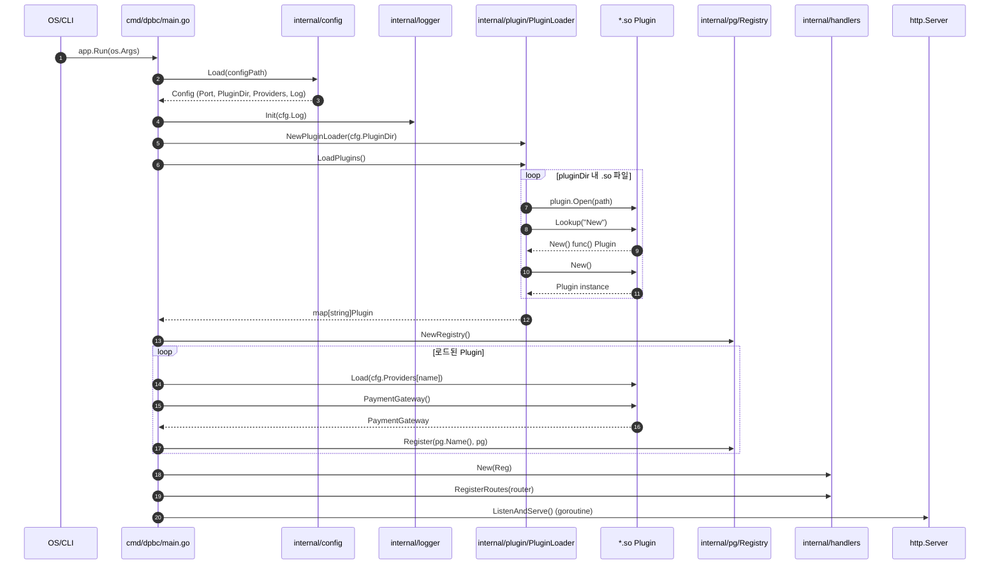
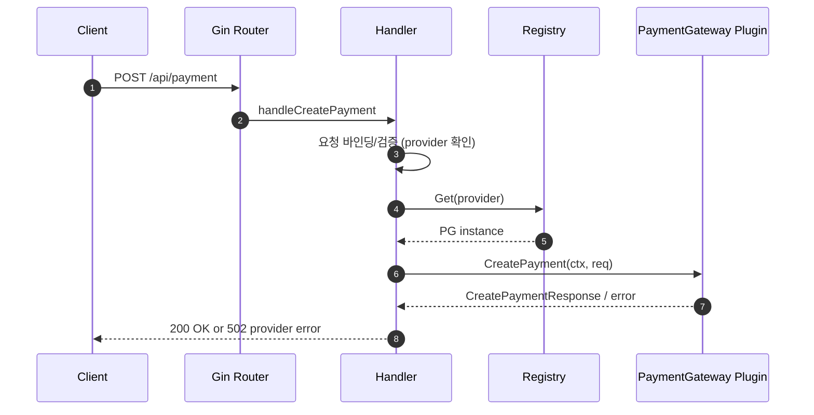
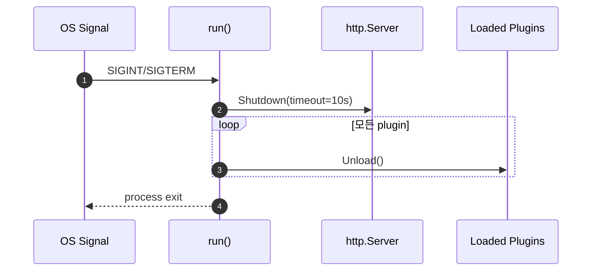

# DPBC Flow

## Startup Flow

```mermaid
sequenceDiagram
    autonumber
    participant OS as OS/CLI
    participant Main as cmd/dpbc/main.go
    participant Cfg as internal/config
    participant Log as internal/logger
    participant Loader as internal/plugin/PluginLoader
    participant So as *.so Plugin
    participant Reg as internal/pg/Registry
    participant H as internal/handlers
    participant HTTP as http.Server

    OS->>Main: app.Run(os.Args)
    Main->>Cfg: Load(configPath)
    Cfg-->>Main: Config (Port, PluginDir, Providers, Log)
    Main->>Log: Init(cfg.Log)

    Main->>Loader: NewPluginLoader(cfg.PluginDir)
    Main->>Loader: LoadPlugins()
    loop pluginDir 내 .so 파일
        Loader->>So: plugin.Open(path)
        Loader->>So: Lookup("New")
        So-->>Loader: New() func() Plugin
        Loader->>So: New()
        So-->>Loader: Plugin instance
    end
    Loader-->>Main: map[string]Plugin

    Main->>Reg: NewRegistry()
    loop 로드된 Plugin
        Main->>So: Load(cfg.Providers[name])
        Main->>So: PaymentGateway()
        So-->>Main: PaymentGateway
        Main->>Reg: Register(pg.Name(), pg)
    end

    Main->>H: New(Reg)
    Main->>H: RegisterRoutes(router)
    Main->>HTTP: ListenAndServe() (goroutine)
```

## Request Flow

```mermaid
sequenceDiagram
    autonumber
    participant Client
    participant Router as Gin Router
    participant H as Handler
    participant Reg as Registry
    participant PG as PaymentGateway Plugin

    Client->>Router: POST /api/payment
    Router->>H: handleCreatePayment
    H->>H: 요청 바인딩/검증 (provider 확인)
    H->>Reg: Get(provider)
    Reg-->>H: PG instance
    H->>PG: CreatePayment(ctx, req)
    PG-->>H: CreatePaymentResponse / error
    H-->>Client: 200 OK or 502 provider error
```

## Shutdown Flow

```mermaid
sequenceDiagram
    autonumber
    participant OS as OS Signal
    participant Main as run()
    participant HTTP as http.Server
    participant So as Loaded Plugins

    OS->>Main: SIGINT/SIGTERM
    Main->>HTTP: Shutdown(timeout=10s)
    loop 모든 plugin
        Main->>So: Unload()
    end
    Main-->>OS: process exit
```
